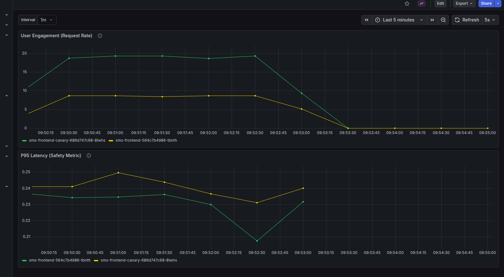

# Continuous Experimentation: UI Engagement Test

## 1. Experiment Description
We have introduced a new **Canary (v2)** version of the frontend application.
* **Change:** The Canary version includes a completely redesigned User Interface (UI).
* **Goal:** To determine if the new UI design effectively increases user engagement compared to the current Stable (v1) design.
* **Method:** We are using an **Istio Service Mesh** to route 10% of real user traffic to the Canary version while maintaining 90% on the Stable version.

## 2. Hypothesis & Metric
**Hypothesis:** The improved UI in v2 will encourage users to interact with the application more frequently than v1.

**Metric: Request Throughput (Requests Per Second)**
We define "Engagement" as the rate of POST requests received by the backend.
* **Metric Query:** `rate(sms_requests_total)` derived from Prometheus.
* **Success Condition:** The Canary version must show a significantly higher Request Rate (RPS) than the Stable version.
* **Safety Condition:** The P95 Latency of the Canary version must not exceed the Stable version by more than 10%.

## 3. Experimental Setup
All components are deployed via the central `sms` Helm chart.

### Deployed Versions
* **Stable (v1):** Image `sms-frontend:2.1.1` (Replicas: 1)
* **Canary (v2):** Image `sms-frontend:latest` (Replicas: 1)

### Reachability & Routing
We utilize **Istio VirtualServices** to manage traffic. Per the assignment requirements, we support both explicit direct access (for grading) and probabilistic splitting (for the experiment).

**1. Direct URL Access (Grading Requirement):**
We configured dedicated hostnames in `values.yaml` to allow direct access to specific versions, bypassing the canary logic.
* **Stable Version:** Accessible via `stable.local` (routes 100% to Stable).
* **Canary Version:** Accessible via `canary.local` (routes 100% to Canary).

**2. Public Access (Experiment Logic):**
For the main URL (`sms.test.local`), we use:
* **Sticky Sessions:** Identifying users via the `sms-user` cookie.
* **Traffic Split:** 90% Stable / 10% Canary for new users.

## 4. Decision Process
We rely on the **SMS A4 Experiment Dashboard** in Grafana to validate the hypothesis.

### Decision Logic
1.  **Check Engagement (Primary Metric):**
    * Observe the "User Engagement (Request Rate)" panel.
    * **IF** the Canary (Green) trend line is consistently **higher** than the Stable (Yellow) line, the hypothesis is **Supported**.
    * **IF** the Canary line is lower or equal, the hypothesis is **Rejected**.

2.  **Check Safety (Secondary Metric):**
    * Observe the "P95 Latency" panel.
    * **IF** Canary latency spikes > 500ms or exceeds Stable by >10%, **ABORT** immediately.

### Conclusion (Experiment Results)
Running the experiment revealed a distinct increase in engagement on the v2 platform.
* **Engagement:** The Canary version sustained **~20 RPS**, while Stable remained at **~9 RPS**.
* **Latency:** Both versions remained performant (< 0.25s).
* **Result:** The experiment was **SUCCESSFUL**. The Canary version is approved for promotion.

*Figure 1: Evidence of higher Request Rate on Canary pods compared to Stable pods.*