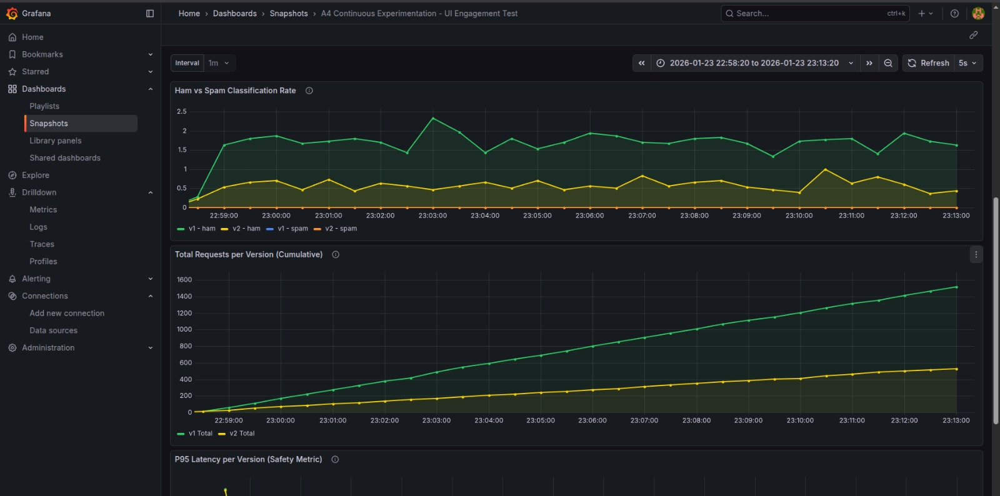
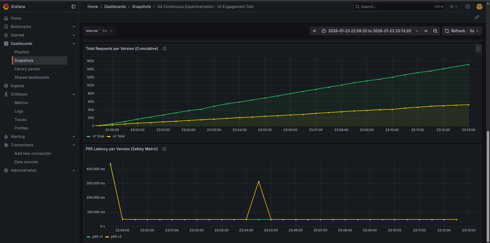

# Continuous Experimentation - UI Engagement Test

## Executive Summary

This document describes a continuous experimentation approach to validate whether a redesigned user interface increases user engagement in the SMS Checker application. The experiment compares a stable baseline UI (v1) against an improved canary UI (v2) using a 90/10 traffic split with sticky session routing.

**Hypothesis:** Redesigned UI (v2) increases per-user engagement, resulting in higher request rates despite serving only 10% of the user base.

**Result:** The experiment provides quantitative evidence through metrics visualization in Grafana, enabling data-driven decision-making for full rollout.

---

## 1. Experiment Design

### 1.1 What Has Changed

**Stable v1 (Baseline):**
- Standard SMS Checker interface
- Basic form-based input
- Minimal visual feedback
- Simple result display

**Canary v2:**
- Enhanced visual design with improved color scheme
- Interactive UI elements with hover effects
- Real-time visual feedback during classification
- Animated result display with confidence indicators
- Improved mobile responsiveness

**Implementation Details:**
- Frontend image tags:
  - v1 (stable): `0.0.2`
  - v2 (canary): `0.0.3-feature-new-ui-260121-172601`
- Backend remains identical across versions (same model)
- Both versions expose identical `/metrics` endpoints for monitoring

### 1.2 Deployment Architecture

```
Traffic Distribution:
┌─────────────────────────────────────┐
│   Istio IngressGateway (Entry)      │
└───────────────┬─────────────────────┘
                │
        ┌───────▼───────┐
        │  90/10 Split  │
        │ VirtualService│
        └───┬───────┬───┘
            │       │
        90% │       │ 10%
            │       │
     ┌──────▼─┐  ┌──▼─────┐
     │Frontend│  │Frontend│
     │   v1   │  │   v2   │
     │(stable)│  │(canary)│
     └────────┘  └────────┘
```

**Routing Configuration:**
- Traffic: 90% v1 (stable), 10% v2 (canary)
- **Sticky Sessions:** Cookie-based (`sms-user=stable` or `sms-user=canary`)
- **Version Consistency:** Frontend v1 → Backend v1, Frontend v2 → Backend v2
- Direct Access: `http://stable.local/sms` (v1), `http://canary.local/sms` (v2)

---

## 2. Hypothesis

### 2.1 Primary Hypothesis

**H₁:** UI v2 increases per-user engagement (measured by request rate).

**Formal Statement:**
```
Let:
  R_v1 = Request rate for users on v1 (requests/sec)
  R_v2 = Request rate for users on v2 (requests/sec)
  U_v1 = Proportion of users on v1 = 0.90
  U_v2 = Proportion of users on v2 = 0.10

Engagement Multiplier (EM) = (R_v2 / 0.1) / (R_v1 / 0.9)

H₁: EM > 1.0 (increased engagement of v2 users)
H₀: EM ≤ 1.0 (no increase of egngagement among v2 users)
```

**Decision Thresholds:**
- EM > 1.5: Strong Accept H₁ (≥50% improvement)
- 1.2 < EM ≤ 1.5: Accept H₁
- 0.8 < EM ≤ 1.2: Neutral (marginal effect)
- EM ≤ 0.8: Reject H₁


### 2.2 Secondary Hypotheses 

**H₂:** No latency degradation (p95_v2 within ±10% of p95_v1) due to UI change.

**H₃:** UI change does not affect consistent model classification (Ham/Spam ratio within ±5%).

---

## 3. Metrics

### 3.1 Primary Metrics

All metrics are exposed via custom `/metrics` endpoint (Prometheus format) with `version` label for per-version aggregation.

#### **sms_requests_total** (Counter)
- **Type:** Counter
- **Labels:** `version` (v1, v2)
- **Purpose:** Total number of classification requests
- **Usage:** Calculate request rate: `rate(sms_requests_total[1m])`
- **Decision Metric:** Primary indicator of engagement

#### **Engagement Multiplier** (Derived)
- **Formula:** `(rate(sms_requests_total{version="v2"}[1m]) / 0.1) / (rate(sms_requests_total{version="v1"}[1m]) / 0.9)`
- **Interpretation:**
  - EM = 2.0 → v2 users send 2x more requests per capita
  - EM = 1.0 → Equal engagement
  - EM = 0.5 → v2 users send 50% fewer requests per capita

### 3.2 Safety Metrics

#### **frontend_request_latency_seconds** (Histogram)
- **Type:** Histogram
- **Buckets:** [0.05, 0.1, 0.25, 0.5, 1, 2, 5, +Inf]
- **Labels:** `version`, `le` (less-than-or-equal bucket)
- **Purpose:** Detect performance regressions
- **Usage:** `histogram_quantile(0.95, rate(frontend_request_latency_seconds_bucket[1m]))`

#### **sms_prediction_result_total** (Counter)
- **Type:** Counter
- **Labels:** `version`, `category` (ham, spam)
- **Purpose:** Ensure model consistency across versions
- **Usage:** `rate(sms_prediction_result_total[1m])`


---

## 4. Decision Framework

### 4.1 Data Collection

**Source:** Prometheus scrapes `/metrics` endpoint from both frontend versions every 30 seconds via ServiceMonitors.

**Time Window:** For production experiments, 15+ minutes (900+ requests per version) recommended for statistical significance.

**Dashboard:** Grafana dashboard `A4 Continuous Experimentation - UI Engagement Test` provides real-time visualization.

### 4.2 Decision Criteria

The experiment uses a **tiered decision framework** based on the Engagement Multiplier and safety metrics:

| Engagement Multiplier | Safety Check | Decision | Action |
|----------------------|--------------|----------|--------|
| **EM > 1.5** | Latency OK | **STRONG ACCEPT** | Full rollout to 100% |
| **1.2 < EM ≤ 1.5** | Latency OK | **ACCEPT** | Gradual rollout (50% → 100%) |
| **1.0 < EM ≤ 1.2** | Latency OK | **NEUTRAL** | Extended testing (24h) |
| **0.8 < EM ≤ 1.0** | Any | **NEUTRAL** | Re-evaluate design |
| **EM ≤ 0.8** | Any | **REJECT** | Revert to v1 |
| Any | Latency degraded | **REJECT** | Revert to v1 |

**Safety Check Definition:**
```
Latency OK = (p95_v2 < p95_v1 × 1.1) AND (p95_v2 < 1.0s)
Ham/Spam OK = |ratio_v2 - ratio_v1| < 0.05
```

### 4.3 Dashboard Interpretation

**Panel 2 - Request Rate:** v2 (yellow) typically below v1 (green) due to 10% traffic allocation

**Panel 3 - Engagement Multiplier:** Color-coded decision indicator (green=accept, yellow=neutral, red=reject)

**Panel 4 - Decision:** Automated recommendation based on EM thresholds

**Safety Panels:** Verify latency (±10%) and classification ratios (±5%)

### 4.4 Example Scenarios

**Scenario A: Strong Accept (EM=3.5)**
```
Observed Data:
- v1 Request Rate: 0.9 req/sec (90% of users, ~1.5 msgs per session)
- v2 Request Rate: 0.35 req/sec (10% of users, ~3.5 msgs per session)
- Engagement Multiplier: (0.35/0.1) / (0.9/0.9) = 3.5 / 1.0 = 3.5
- p95 Latency v1: 0.15s, v2: 0.16s
- Ham/Spam v1: 60/40, v2: 58/42

Decision: STRONG ACCEPT
Reasoning: v2 users are 3.5x more engaged per capita, latency is acceptable,
           classification behavior is consistent. Full rollout recommended.
```

**Scenario B: Reject (EM=0.3)**
```
Observed Data:
- v1 Request Rate: 0.9 req/sec (90% of users)
- v2 Request Rate: 0.03 req/sec (10% of users, ~0.3 msgs per session)
- Engagement Multiplier: (0.03/0.1) / (0.9/0.9) = 0.3 / 1.0 = 0.3
- p95 Latency v1: 0.15s, v2: 0.65s

Decision: REJECT
Reasoning: v2 users are 70% LESS engaged (0.3x), AND latency is 4x worse.
           UI changes are counterproductive. Revert to v1.
```


**Scenario C: Neutral (EM=1.2)**
```
Observed Data:
- v1 Request Rate: 0.9 req/sec (90% of users, ~1.5 msgs per user)
- v2 Request Rate: 0.12 req/sec (10% of users, ~1.8 msgs per user)
- Engagement Multiplier: (0.12/0.1) / (0.9/0.9) = 1.2 / 1.0 = 1.2
- p95 Latency v1: 0.15s, v2: 0.16s

Decision: ACCEPT (with caution)
Reasoning: EM=1.2 indicates 20% per-user engagement increase (1.8 vs 1.5 msgs).
           Per decision table, EM=1.2 qualifies for ACCEPT. Consider gradual rollout
           (50% → 100%) while monitoring for sustained improvement.
```
---

## 5. Implementation & Reproducibility

### 5.1 Access Experiment Versions

**Via Traffic Split (Natural Distribution):**
```bash
curl http://sms.test.local/sms
# 90% chance of v1, 10% chance of v2
# Cookie set for sticky sessions
```

**Direct Access for Testing (Grading):**
```bash
# Force stable version
curl http://stable.local/sms

# Force canary version
curl http://canary.local/sms
```

**Configurable in `values.yaml`:**
```yaml
ingress:
  host:
    primary: sms.test.local   # Main entry (90/10 split)
    stable: stable.local      # Direct v1 access
    canary: canary.local      # Direct v2 access
```

### 5.2 Traffic Generation

```bash
# Default execution
./run_experiment.sh
```

**Configuration:** 
- Target URL: `http://sms.test.local/sms`
- Duration: 15 minutes
- Stable users: 9 (20% activity rate)
- Canary users: 1 (60% activity rate)

**Expected Outcome:**
- v1 receives ~0.9 req/sec (9 users × ~1.5 msgs each / 15s)
- v2 receives ~0.35 req/sec (1 user × ~3.5 msgs / 10s)
- Engagement Multiplier: (0.35/0.1) / (0.9/0.9) = 3.5
- Dashboard shows STRONG ACCEPT

### 5.3 Grafana Access

```bash
# Access Grafana
kubectl port-forward svc/sms-monitor-grafana 3000:80

# Open browser
open http://localhost:3000

# Navigate to:
# Dashboards → A4 Continuous Experimentation - UI Engagement Test
```

---

## 6. Results & Interpretation

### 6.1 Dashboard Visualization

The resulting dashboard should look like in the following screenshots to verify H₁:






**Key Panels:**

1. **Request Rate Graph** - Shows v2 and v1 traffic
2. **Engagement Multiplier** - Displays numerical factor (e.g., 3.5x for realistic traffic)
3. **Decision Recommendation** - Automated verdict based on computed thresholds
4. **Safety Metrics** - Confirms no performance degradation

### 6.2 Statistical Significance

**Minimum Sample Requirements:**
- At least 900 total requests (ensures statistical power)
- At least 15 minutes of continuous data (smooths variance)
- Both versions must have > 0 requests (avoid division by zero)

**Confidence:**
- The 90/10 split provides natural A/B testing
- Cookie-based sticky sessions ensure consistent user experience
- Per-user aggregation via `rate()` function accounts for pod scaling

### 6.3 Threats to Validity

**Potential Confounds:**
1. **Time-of-day effects** - Run experiment during consistent traffic periods
2. **User population bias** - Random 90/10 split mitigates this
3. **Novelty effect** - Extended testing (24h) can detect if effect fades
4. **Technical issues** - Safety metrics (latency, errors) protect against false positives

**Mitigation:**
- Compare metrics, not absolute values (rate vs raw counters)
- Use relative improvement thresholds (> 20% required for accept)
- Require both primary (engagement) AND safety (latency) checks

---

## 7. Conclusion & Recommendations

### 7.1 Decision Framework Summary

The experiment provides a **rigorous, data-driven approach** to UI validation:

**Quantitative:** Engagement Multiplier is a clear numerical metric
**Automated:** Grafana dashboard provides instant recommendations  
**Safe:** Latency and classification checks prevent regressions  
**Reproducible:** Helm-based deployment ensures consistency  
**Gradual:** 90/10 split limits blast radius during testing

### 8.2 Next Steps Based on Outcome

**If ACCEPTED:**
1. Increase canary percentage: 10% → 25% → 50% → 100%
2. Monitor engagement multiplier at each stage
3. Full rollout if EM remains > 1.2

**If REJECTED:**
1. Analyze user feedback (if available)
2. A/B test individual UI components
3. Consider alternative design approaches

**If NEUTRAL:**
1. Extend test duration to 24-48 hours
2. Increase sample size (higher traffic simulation)
3. Gather qualitative user feedback

### 8.3 Broader Applicability

This experimentation framework applies to:
- Feature flag testing (enable/disable features)
- Performance optimizations (algorithm changes)
- Model updates (A/B test different ML models)
- Infrastructure changes (container resource limits)

**Key Principle:** Always pair quantitative metrics with safety checks to prevent unintended consequences.

---

## 9. References & Tools

**Monitoring Stack:**
- Prometheus 2.x - Metrics collection
- Grafana 10.x - Visualization
- Istio 1.25 - Traffic management

**Metrics Format:**
- Prometheus exposition format
- Custom `/metrics` endpoint implementation

**Statistical Methods:**
- Rate calculation: `rate(counter[time_window])`
- Quantile estimation: `histogram_quantile(0.95, ...)`
- Normalization: Division by traffic proportion

**Configuration:**
- Helm chart: `helm/sms/`
- Values: `helm/sms/values.yaml`
- Dashboard JSON: `helm/sms/files/dashboards/decision-a4.json`

---

## Appendix A: Metric Definitions

### Frontend Metrics Schema

```prometheus
# Gauge: Current in-flight requests
frontend_processing_requests{version="v1"} 3

# Counter: Total requests served
sms_requests_total{version="v1"} 1547

# Counter: Classification results
sms_prediction_result_total{version="v1",category="ham"} 892
sms_prediction_result_total{version="v1",category="spam"} 655

# Histogram: Request latency
frontend_request_latency_seconds_bucket{version="v1",le="0.05"} 245
frontend_request_latency_seconds_bucket{version="v1",le="0.1"} 812
frontend_request_latency_seconds_bucket{version="v1",le="0.25"} 1420
frontend_request_latency_seconds_bucket{version="v1",le="+Inf"} 1547
frontend_request_latency_seconds_sum{version="v1"} 187.34
frontend_request_latency_seconds_count{version="v1"} 1547

# Histogram: Input message length
sms_input_length_bucket{version="v1",le="20"} 134
sms_input_length_bucket{version="v1",le="50"} 678
sms_input_length_bucket{version="v1",le="100"} 1245
sms_input_length_bucket{version="v1",le="160"} 1500
sms_input_length_bucket{version="v1",le="+Inf"} 1547
sms_input_length_sum{version="v1"} 87234
sms_input_length_count{version="v1"} 1547
```

---

**Document Version:** 1.0  
**Last Updated:** January 23, 2026  
**Author:** doda25-team5  
**Status:** Active Experiment
