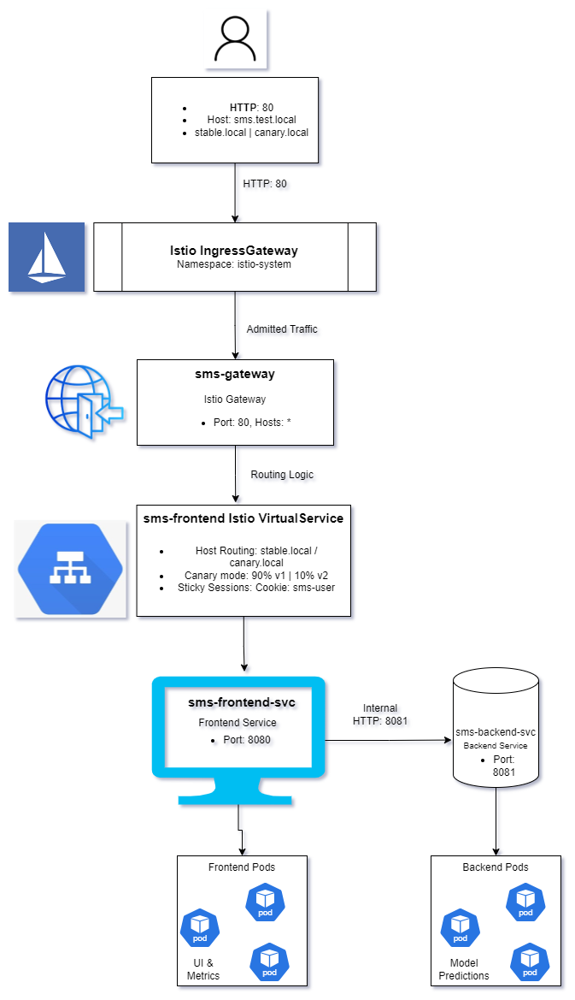

# Deployment Overview

This document describes the final deployment structure of the SMS application and explains how requests flow through the system. The goal of this documentation is to provide a clear, high-level overview of the deployed components and their interactions within our cluster, such that a new team member can understand the system design and participate in architectural discussions as described in the rubric. 

---

## System Components

The SMS application consists of two main services deployed in the Kubernetes cluster:

- **sms-frontend**  
  The application service that users see/use. It handles incoming HTTP requests and serves the application’s user interface. The frontend exposes an HTTP endpoint on port **8080**, which is defined in `values.yaml` and used as the container port in the Deployment.

- **sms-backend**  
  The backend service that provides model predications to the frontend. The backend exposes an HTTP endpoint on port **8081** and is not directly accessible from outside the cluster. It only receives traffic from the frontend service.

Both services are deployed as Kubernetes Deployments and exposed internally via Kubernetes Services. Istio traffic management resources are used to control routing behavior between different versions of the frontend service.

---

## Namespaces

The application is deployed into a Kubernetes namespace called `sms`. This namespace contains all application related resources including the `sms-frontend` and `sms-backend` services, their Deployments, Services, and all associated Istio configuration resources such as Gateways, VirtualServices, and DestinationRules. It is used during the helm chart installation. 

Observability components, including Prometheus and Grafana, are deployed in a separate monitoring namespace. Prometheus scrapes metrics exposed by both the frontend and backend services, while Grafana visualizes these metrics to support monitoring and continuous experimentation.

Additional system namespaces (for example, the Kubernetes Dashboard and Istio control plane resources) exist to support cluster operation and are not part of the application deployment itself.

---

## Traffic Entry Point

External traffic enters the cluster through the Istio IngressGateway. The ingress gateway is configured via the `sms-gateway` Gateway resource, which accepts **HTTP traffic on port 80** for **any host** (`*`).

The Gateway selects an existing Istio ingress gateway using a configurable label defined in `values.yaml` (`ingressgateway.ingressGatewayLabel`). The ingress gateway itself is installed during cluster provisioning and is not managed by the application Helm chart.

---

## Request Flow and Traffic Routing

An example request flows through the system as follows:

1. A user sends an HTTP request to the application on port 80. The request may use different hostnames, such as `sms.test.local`,
   `stable.local`, or `canary.local`, depending on the routing behavior that you want.

2. The request is received by the Istio IngressGateway, which serves as the external entry point to the service mesh.

3. The request is admitted by the `sms-gateway` Istio Gateway resource. This gateway listens for HTTP traffic on port 80 and accepts requests for any host.

4. After this, the request is processed by the Istio VirtualService associated with the frontend service. The VirtualService is responsible for all routing decisions:
   - Host based routing is used to force traffic to either the stable or canary version for grading and debugging purposes (`stable.local` or `canary.local`).
   - Sticky sessions are implemented using an HTTP cookie (`sms-user`) to ensure that a user is consistently routed to the same frontend version across multiple requests.
   - When it comes to the canary deployment, the VirtualService applies a 90/10 traffic split, routing 90% of requests to the stable frontend version (v1) and 10% to the canary version (v2).
   - In shadow mode, all traffic is routed to the stable version while requests are mirrored to the canary version without affecting the
     client response.

5. The VirtualService routes the request to the Kubernetes Service `sms-frontend-svc`, which exposes the frontend application on port
   8080 and load balances traffic across the frontend pods.

6. The frontend pods process the request and send HTTP requests to the backend service via the `sms-backend-svc` Kubernetes Service.

7. The backend service listens on port 8081 and forwards requests to the backend pods, which perform do the model sms predictions and return
results to the frontend.

---

## Canary Deployment and Traffic Management

The deployment supports canary releases of the frontend service using Istio DestinationRules and VirtualServices.

Two versions of the frontend are released:

- **Stable version (v1)**  
  Represents the current default version of the frontend.

- **Canary version (v2)**  
  Represents a new frontend version that is evaluated through continuous experimentation with a better UI. 

The routing behavior depends on the configured traffic mode:

- **Standard mode**  
  100% of traffic is routed to the stable frontend version.

- **Canary mode**  
  Traffic is split using a **90/10 ratio**, where 90% of requests are routed to the stable version (v1) and 10% are routed to the canary version (v2).  This split is configured directly in the Istio VirtualService, where routing decisions are made.

- **Shadow mode**  
  100% of traffic is routed to the stable version, while requests are mirrored to the canary version. Mirrored requests do not affect the client response and are used to test the behavior of the new version without exposing it to users.

---

## Deployment Diagram

> **Figure 1: Deployment Structure and Request Flow of the SMS Application**

The diagram visualizes:
- External user traffic entering via the Istio IngressGateway
- The `sms-gateway` Gateway accepting HTTP traffic on port 80
- Routing decisions taken at the Istio VirtualService
  (host-based routing, sticky sessions, 90/10 canary split)
- Traffic flowing to `sms-frontend-svc` (port 8080)
- Internal communication to `sms-backend-svc` (port 8081)

## Sticky Sessions

Sticky sessions ensure that once a user is routed to either the stable or canary frontend version, further requests from that user are always routed to the same version. This prevents users from switching between versions across page reloads.

Sticky routing is implemented at the Istio VirtualService level using HTTP cookies. During canary routing, the VirtualService injects a cookie (`sms-user`) that encodes whether a user is assigned to the stable or canary version. The next requests from the user are matched on this cookie and routed to the corresponding frontend (v1 or v2).

For grading and debugging purposes, additional host based routing rules are configured that allow traffic to be forced to either the stable or canary version using specific hostnames.

---

## Observability and Monitoring

The deployment includes an observability stack based on Prometheus and Grafana.

Both the frontend and backend services expose application specific metrics via HTTP endpoints. These metrics include information about user interactions, page visits, application behaviour, etc. 

Prometheus scrapes the metrics endpoints of both services and stores the collected data. Grafana dashboards visualize these metrics and allow comparisons between the stable and canary frontend versions, allowing us to see the comparison during during continuous experimentation.

---

