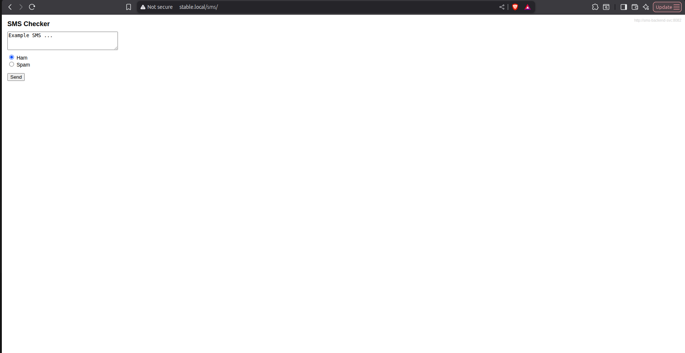
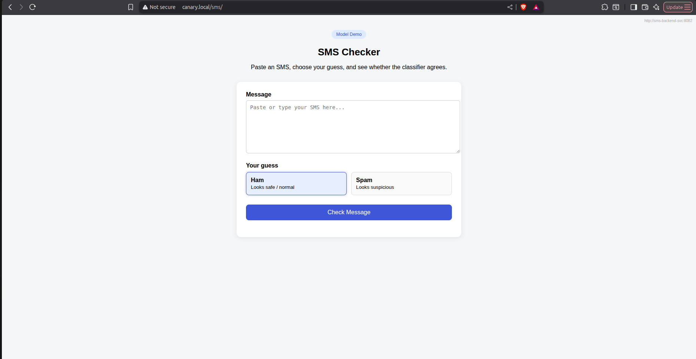
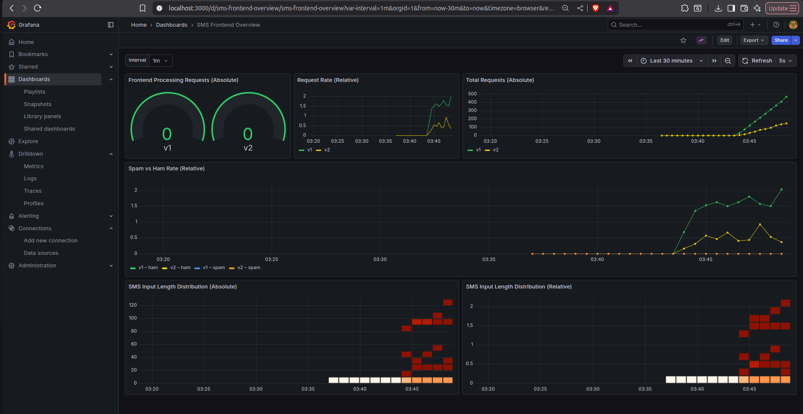
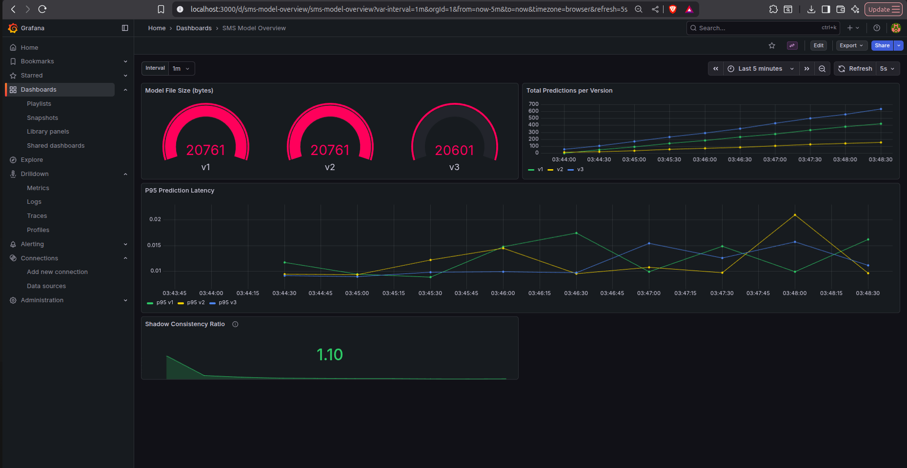
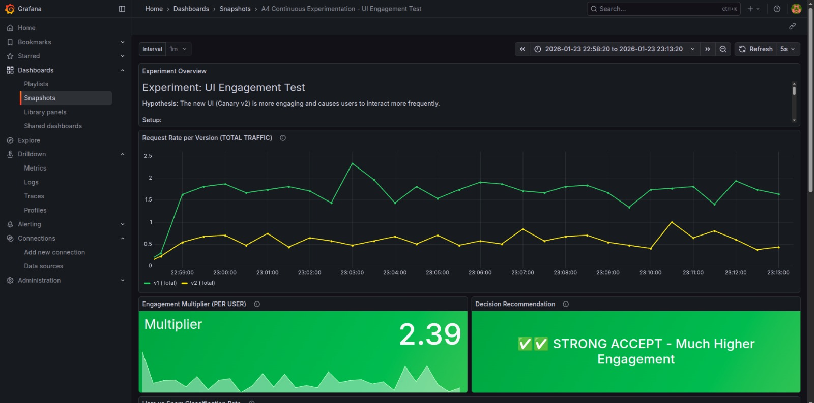
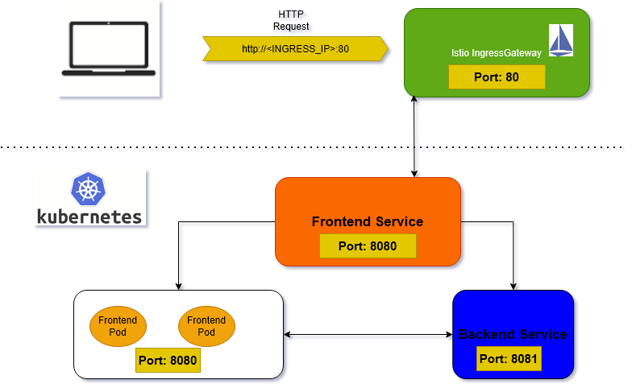
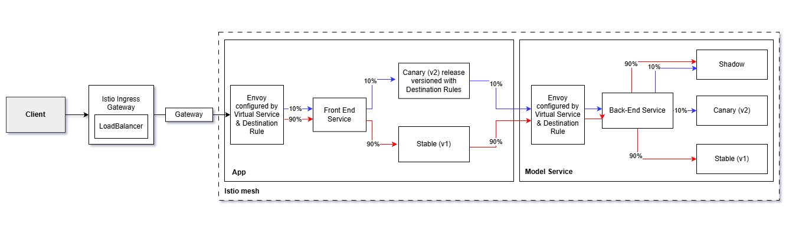
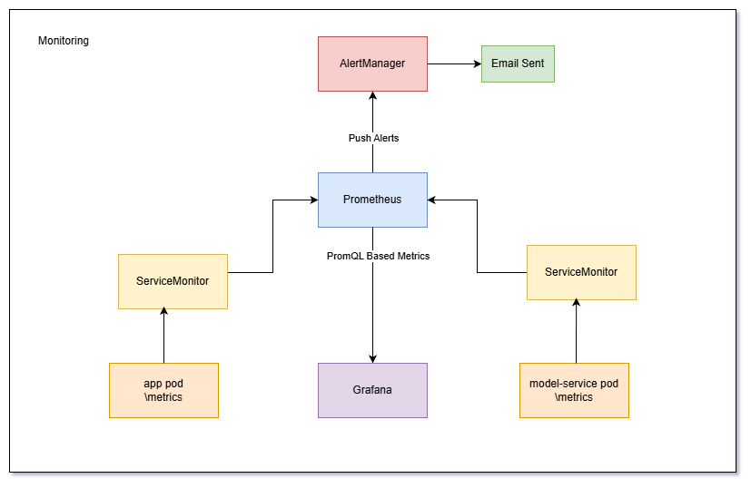

# Deployment Overview

This document describes the final deployment structure of the SMS application and explains how requests flow through the system. The goal is to clarify the project setup to an outsider (e.g., a new team member), such that they can understand the overall design and participate in architectural and experimental design discussions.

The documentation focuses on the conceptual deployment structure at the Kubernetes and Istio level. 

---

## 1. Deployment Scope and Assumptions

This document provides a high-level, conceptual overview of the deployed system.

- The focus is on **deployed components, their roles, and their relations**
- Request flow and traffic routing decisions are explained at an abstract level

The deployment uses Kubernetes as the orchestration platform and Istio as the service mesh for traffic management and experimentation.

---

## 2. Deployed Namespaces

All application and monitoring related resources are deployed into the `default` namespace. This namespace contains:

- Frontend and backend Deployments
- Kubernetes Services exposing these Deployments
- Istio traffic management resources (Gateway, VirtualServices, DestinationRules)
- Observability-related resources such as ServiceMonitors
- Prometheus for metrics collection
- Grafana for metrics visualization
---

## 3. Application-Level Components (Logical View)

This section describes the logical components of the SMS application, independent of Kubernetes implementation details.

### 3.1 SMS Frontend

The frontend is the user-facing component of the application. It:

- Handles incoming HTTP requests from external users
- Serves the application user interface
- Communicates with the backend service for model predictions

#### Available endpoints
- `/metrics` - for accessing front-end metrics
- `/sms` - for accessing the application
- `/lib-version` - for accessing the lib-version number

Multiple versions of the frontend (stable and canary) may be deployed simultaneously for experimentation purposes.

### 3.2 SMS Backend

The backend service provides model predictions to the frontend. It:

- Is not directly accessible from outside the cluster
- Only receives traffic from the frontend service
- Exposes an internal HTTP endpoint used for prediction requests

### 3.3 Observability Components (Logical View)

The application exposes metrics that describe its runtime behavior, such as request counts and version-specific interactions. These metrics are collected and visualized to support monitoring and continuous experimentation.

---

## 4. Kubernetes and Istio Resources and Their Roles

This section describes all Kubernetes and Istio resources that make up the SMS deployment.  
For each resource type, we first explain its **role in the system**, followed by a **concrete overview of how it is instantiated in our deployment**.

The goal is to clarify *what exists*, *why it exists*, and *how it contributes to request handling and experimentation*.

### 4.1 Deployments

Kubernetes Deployments are used to manage application workloads and ensure reliable execution of frontend and backend services.

In our deployment:
- Separate Deployments exist for the frontend and backend
- Multiple versions of the frontend (stable and canary) are deployed simultaneously
- Deployments manage pod replicas, updates, and lifecycle

**Frontend Deployments**
- **Stable frontend:** `sms-frontend`  
  Labels: `app: sms-frontend`, `version: v1`
  

   
  <em>Stable version</em>

  
- **Canary frontend:** `sms-frontend-canary`  
  Labels: `app: sms-frontend`, `version: v2`

   
  <em>Canary version</em>

  

**Backend Deployments**
- **Stable backend:** `sms-backend`  
  Labels: `app: sms-backend`, `version: v1`
- **Canary backend:** `sms-backend-canary`  
  Labels: `app: sms-backend`, `version: v2`

Version labels are later used by Istio to perform version-aware routing.

### 4.2 Services

Kubernetes Services provide stable network identities and load balancing over pods managed by Deployments.

They decouple service discovery from pod lifecycle and are the main abstraction used by Istio for traffic routing.

**Frontend Service**
- **Service:** `sms-frontend-svc`
- Port: `8080`
- Selector: `app: sms-frontend`
- Role:
  - Exposes the frontend internally within the cluster
  - Load balances traffic across stable and canary frontend pods

**Backend Service**
- **Service:** `sms-backend-svc`
- Port: `8081`
- Selector: `app: sms-backend`
- Role:
  - Exposes the backend internally
  - Only accessible from within the cluster (primarily by the frontend)

### 4.3 Istio Gateway

The Istio Gateway defines how external traffic enters the service mesh.

In this deployment:
- The gateway listens for HTTP traffic on port 80
- It serves as the single external entry point into the cluster
- It forwards traffic into the mesh for further routing decisions

**Gateway Resource**
- **Gateway:** `sms-gateway`
- Accepts HTTP traffic on port 80
- Matches all hosts
- Selects the Istio ingress gateway using the label `istio: ingressgateway`

The Gateway itself does not perform routing; it only admits traffic into the mesh.

### 4.4 Istio VirtualServices

Istio VirtualServices define **how requests are routed once they are inside the service mesh**.  
They are the central component for implementing dynamic routing and experimentation logic.

#### Frontend VirtualService

- **VirtualService:** `sms-frontend`
- Role:
  - Routes external traffic to the frontend service
  - Implements all routing logic for experimentation

Routing capabilities include:
- Host-based routing (e.g., forcing stable or canary versions for grading/debugging)
- Cookie-based routing for sticky sessions
- Traffic splitting for canary experiments (e.g., 90/10 split)
- Traffic mirroring for shadow experiments

All routing decisions for incoming user traffic are taken at this VirtualService.

#### Backend VirtualService

- **VirtualService:** `sms-backend`
- Role:
  - Routes requests from frontend v1/v2 to corresponding backend versions with source labels
  - Enables backend versioning consistency during experiments

### 4.5 Istio DestinationRules

DestinationRules define **subsets of a service**, typically corresponding to different versions of an application.

They enable version-aware routing when combined with VirtualServices.

**Frontend DestinationRule**
- **DestinationRule:** `sms-frontend`
- Subsets:
  - `stable` -> `version: v1`
  - `canary` -> `version: v2`

**Backend DestinationRule**
- **DestinationRule:** `sms-backend`
- Subsets:
  - `stable` -> `version: v1`
  - `canary` -> `version: v2`
  - `shadow` -> `version: v3`  

VirtualServices select these subsets to route traffic to specific versions.

### 4.6 Configuration Resources

Configuration is externalized using Kubernetes ConfigMaps to decouple runtime configuration from container images. This allows different deployments to be configured independently without rebuilding images and supports experimentation across versions.

#### Frontend Configuration

- **ConfigMap:** `sms-frontend-config`

The frontend uses a **single shared ConfigMap**, even though multiple frontend deployments (stable and canary) exist.

This is because:
- All frontend versions communicate with the same backend service
- Backend hostnames and ports are the same across frontend versions
- The frontend experiment focuses on UI and behavior changes, not backend connectivity

Using a single ConfigMap ensures configuration consistency across frontend versions and avoids unnecessary duplication, while still allowing version-specific behavior to be implemented inside the application code.

#### Backend Configuration

Each backend deployment uses its **own ConfigMap**, allowing backend versions to be configured independently.

- **Stable backend ConfigMap:** `sms-backend-config-stable`
- **Canary backend ConfigMap:** `sms-backend-config-canary`
- **Shadow backend ConfigMap:** `sms-backend-config-shadow`

These ConfigMaps contain:
- Model configuration
- Preprocessing parameters
- Version-specific runtime settings

Separate ConfigMaps are required because:
- Backend versions may use different models or preprocessing pipelines
- Canary and shadow deployments may experiment with new model versions or parameters
- Independent configuration allows backend behavior to be different safely across experiments

This design enables backend experimentation without affecting the stable backend or requiring image rebuilds.

#### Secrets

Sensitive configuration is handled using  Secrets to prevent credentials from being exposed in container images or configuration files.

- **Secret:** `sms-secrets`

This Secret stores the Gmail app password required by Alertmanager to send notification emails. It is injected into the Alertmanager component at runtime, ensuring secure handling of sensitive data.

### 4.7 Monitoring Resources

Monitoring is integrated using Prometheus and Grafana to monitor application behavior, support continuous experimentation, and detect abnormal system conditions through alerting.

The monitoring setup focuses on **application-level metrics**, allowing us to visualize request behavior, performance trends, and experiment impacts.

#### ServiceMonitors

ServiceMonitors are used to enable Prometheus to discover and scrape metrics exposed by the application services.

- **Frontend ServiceMonitor:** `sms-frontend-sm`
  - Scrapes metrics from all frontend service deployments and instances
  - Matches services labeled `app: sms-frontend`
  - Collects metrics such as:
    - HTTP request rates
    - Version-specific request counts (stable vs canary)
    - Request handling behavior under experimental traffic

- **Backend ServiceMonitor:** `sms-backend-sm`
  - Scrapes metrics from backend service deployments and instances
  - Matches services labeled `app: sms-backend`
  - Collects metrics related to:
    - Total predictions
    - Model size bytes

ServiceMonitors allow metrics to be collected consistently across stable, canary, and shadow deployments.

#### PrometheusRules (Alerting Logic)

Alerting behavior is defined using PrometheusRules that continuously evaluate collected metrics and trigger alerts when predefined conditions are met.

- **PrometheusRule:** `sms-frontend-rules`
- Deployed in the **default namespace**

Currently, the deployment defines the following alert:

- **Alert name:** `HighFrontendRequestRate`
- **Condition:**  
  The frontend request rate receives more than 15 requests per minute continuously for **2 minutes**
- **Purpose:**  
  Detects abnormal traffic spikes or unexpected load.

#### Alertmanager Configuration and Notification Delivery

Alert delivery and notification routing are handled by Alertmanager.

- **AlertmanagerConfig:** `sms-alerts`
- Deployed in the **default namespace**

Alertmanager is configured to:
- Send alert notifications via **Gmail email**
- Route alerts to a predefined recipient inbox for the project team
- Group alerts by **alert name**, ensuring that repeated firings of the same alert are aggregated into a single notification thread

Grouping alerts by `alertname` reduces notification noise and makes it easier to track ongoing incidents without being overwhelmed by duplicate messages.

#### Grafana Dashboards

Grafana is used to visualize application-level metrics collected by Prometheus and allow us to analyze different metrics across development and cthe continuous experimentation. 

All dashboards are provisioned via a single ConfigMap:

- **Grafana Dashboards ConfigMap:** `sms-grafana-dashboards`

This ConfigMap defines **three predefined dashboards**, each serving a distinct purpose in the system.

--- 

##### Frontend Dashboard

The **Frontend Dashboard** provides an overview of user-facing behavior and request patterns across frontend versions (stable and canary).

It visualizes frontend-specific metrics such as:
- **Request rate** per version  
  (counter → rate), based on `sms_requests_total`
- **Total request count** per version  
  (counter), showing cumulative traffic
- **Frontend processing concurrency**  
  (gauge), indicating in-flight requests
- **Classification result rates** (spam vs ham)  
  (counter → rate), based on `sms_prediction_result_total`
- **Input length distributions**  
  (histogram), visualized as heatmaps using `sms_input_length_bucket`

---

##### Backend Dashboard

The **Backend Dashboard** focuses on model-related behavior and backend performance.

It includes metrics such as:
- **Total predictions per version**  
  (counter), using `model_predictions_total`
- **Prediction latency (P95)**  
  (histogram → quantile), derived from `model_prediction_latency_seconds_bucket`
- **Model file size per version**  
  (gauge), using `model_file_size_bytes`
- **Shadow consistency ratio**  
  (derived metric), comparing shadow predictions against stable and canary outputs

---

##### Continuous Experimentation Dashboard (Frontend Canary)

The **Continuous Experimentation Dashboard** is specifically designed for the support and evaluation of the frontend canary experiment.

It visualizes the experiment hypothesis:
> *Does the new frontend UI (v2 canary) increase user engagement compared to the stable version (v1)?*
> 

Key metrics and visualizations include:
- **Request rate per version (key metric)**  
  (counter → rate), based on `sms_requests_total`
- **Engagement multiplier**  
  (derived metric), normalizing request rates by traffic split (90/10)
- **Automated decision recommendation**  
  (stat panel), classifying the experiment outcome (accept / reject)
- **Classification result rates** (spam vs ham)  
  (counter → rate), used as a safety check
- **P95 frontend latency per version** 
  (histogram → quantile), ensuring performance is not degraded

### 4.8 Optional and Supporting Resources

- **Optional Ingress:** `sms-frontend-ingress`
  - Used only if NGINX ingress is enabled
  - Not part of the default Istio-based request path

## 5. Configurable Values

These are the key configurable values in `values.yml` that can be adjusted during deployment:

**Deployment Mode**  
- `istio.enabled` → enable Istio mesh (true/false)  
- `ingress.enabled` → enable NGINX ingress (true/false)  

**Frontend**  
- `replicas` → number of stable pods  
- `canaryReplicas` → number of canary pods  
- `image.repository` / `image.stableTag` / `image.canaryTag` → container images and versions  
- `service.port` → service port  
- `config.backendHost` / `config.backendPort` → backend connection  

**Backend**  
- `replicas` → stable pods  
- `canaryReplicas` → canary pods  
- `shadow.enabled` → enable shadow deployment  
- `shadow.replicas` → shadow pods  
- `image.repository` / `image.stableTag` / `image.canaryTag` / `image.shadowTag` → container images and versions  
- `service.port` → service port 

**Traffic Management**  
- `traffic.mode` → `standard` = 100% stable, `canary` = split traffic  

**Monitoring & Alerts**  
- `monitoring.enabled` → enable Prometheus/Grafana/AlertManager  
- `alerts.email.enabled` → enable email alerts  
- `alerts.email.to` → recipient email

## 6. External Access Model

External users access the application through the Istio IngressGateway.

- Requests are sent over HTTP on port 80
- Different hostnames may be used to influence routing behavior
  (e.g., stable-only or canary-only access for grading and debugging)
- No direct external access to backend services is allowed

This access model provides a controlled entry point into the cluster.

---

## 7. Request Flow Through the Cluster

This section explains how requests progress through the cluster under different routing scenarios.  
Each flow describes how Kubernetes and Istio resources interact to route traffic from external users to application pods, and how routing decisions are applied during experimentation.

### 7.1 Baseline Request Flow (Stable Only)

In the baseline scenario, no experimentation is active and all traffic is routed to the stable frontend version.

1. **Client Request**  
   A user sends an HTTP request to the application hostname (e.g., `sms.test.local`).  
   From the user’s perspective, the request is sent over HTTP on port 80.

2. **IngressGateway (External Entry Point)**  
   The request reaches the Istio IngressGateway, which is the only resource exposed externally.  
   The IngressGateway accepts the request on port 80 and forwards it into the service mesh.

3. **Istio Gateway (Traffic Admission)**  
   The `sms-gateway` Gateway resource matches the incoming request based on port and protocol.  
   At this stage, no routing decision is made; the Gateway only determines whether the request is allowed into the mesh.

4. **VirtualService (Routing Decision)**  
   The frontend VirtualService evaluates the request.  
   Since no canary or shadow routing is active, the VirtualService forwards all traffic to the stable frontend subset.

5. **DestinationRule (Subset Resolution)**  
   The VirtualService references the frontend DestinationRule to get the stable subset, which corresponds to frontend pods labeled with `version: v1`.

6. **Frontend Service (Load Balancing)**  
   Traffic is sent to the `sms-frontend-svc` Kubernetes Service, which load balances requests across stable frontend pods.

7. **Frontend → Backend Communication**  
   The frontend pod sends an internal HTTP request to the backend service (`sms-backend-svc`) on port 8081.  
   Backend routing follows a similar VirtualService/DestinationRule mechanism but remains entirely internal to the cluster.

8. **Response Path**  
   The backend returns the prediction to the frontend, which generates the final response.  
   The response is sent back through the service mesh and returned to the user via the IngressGateway.

### 7.2 Canary Experiment Request Flow (90/10 Split)

In the canary experiment, traffic is split between stable and canary frontend versions to evaluate new behavior under real user traffic.

1. **Request Entry**  
   Requests enter the cluster through the IngressGateway and Gateway in the same way as in the baseline flow.

2. **VirtualService (Traffic Splitting Logic)**  
   The frontend VirtualService applies canary routing rules:
   - A percentage-based split is defined (90% stable, 10% canary)
   - Routing decisions are taken **per request**

3. **Sticky Session Evaluation**  
   Before applying the split, the VirtualService checks for the presence of a routing cookie:
   - If a cookie is present, the request is routed consistently to the previously assigned version
   - If no cookie is present, the request is probabilistically assigned to stable or canary

4. **DestinationRule (Version Selection)**  
   Based on the routing decision, the VirtualService selects either the stable or canary subset as defined in the DestinationRule:
   - Stable subset → frontend pods with `version: v1`
   - Canary subset → frontend pods with `version: v2`

5. **Service-Level Load Balancing**  
   The selected traffic is forwarded to the frontend Service, which load balances across pods of the chosen version.

6. **Backend Interaction**  
   Both frontend versions communicate with the backend service in the same way.  
   Backend routing remains internal and does not affect the user-facing experiment.

7. **Response Delivery**  
   Responses are returned to the user through the IngressGateway, with users consistently interacting with a single frontend version across requests.

### 7.3 Shadow Experiment Request Flow

Shadow experiments allow evaluation of new versions without exposing them to users.

1. **Primary Request Path**  
   All user requests are routed to the stable frontend version using the same process as in the baseline flow.

2. **VirtualService (Mirroring Configuration)**  
   The frontend VirtualService is configured to mirror requests:
   - The primary request is forwarded to the stable subset
   - A copy of the request is sent to the shadow (canary) subset

3. **Mirrored Traffic Execution**  
   The mirrored request is processed by the shadow frontend pods:
   - It follows the same internal execution path
   - It may trigger backend requests and generate responses
   - Its response is discarded by the mesh

4. **Isolation from User Response**  
   Only the response from the stable frontend is returned to the user.  
   Mirrored traffic has no impact on user-visible behavior, latency, or correctness.

5. **Observability and Evaluation**  
   Metrics generated by shadow requests are collected and visualized:
   - Request counts
   - Latency

Shadowing enables safe validation of new frontend behavior and performance characteristics before exposing it to users.

---

## 8. Continuous Experimentation Design

The deployment supports continuous experimentation through canary and shadow deployments.

- Canary experiments compare stable and new frontend versions under real traffic
- Shadow experiments observe behavior without impacting users
- Metrics collected during experiments are used to evaluate performance and behavior differences

---

## 9. Monitoring Visualization and Metrics Flow

Metrics flow through the system as follows:

1. Frontend and backend pods expose metrics via HTTP endpoints
2. Prometheus scrapes these metrics using ServiceMonitors
3. Metrics are stored and queried by Prometheus
4. Grafana dashboards visualize metrics and compare experimental variants

This observability setup enables data-driven evaluation of deployment changes.

---

## 10. Summary for New Team Members

In summary:

- External traffic enters through the Istio IngressGateway
- Routing decisions are centralized in the VirtualService
- Canary and shadow experiments are implemented using Istio traffic management
- Metrics are collected via Prometheus and visualized in Grafana

After reading this document, a new team member should be able to understand the deployment structure, reason about request flow, and participate in discussions about routing and experimentation design.
